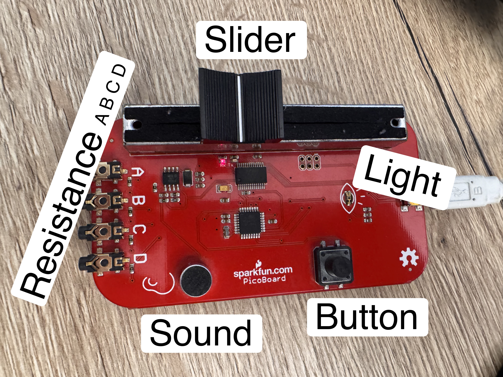
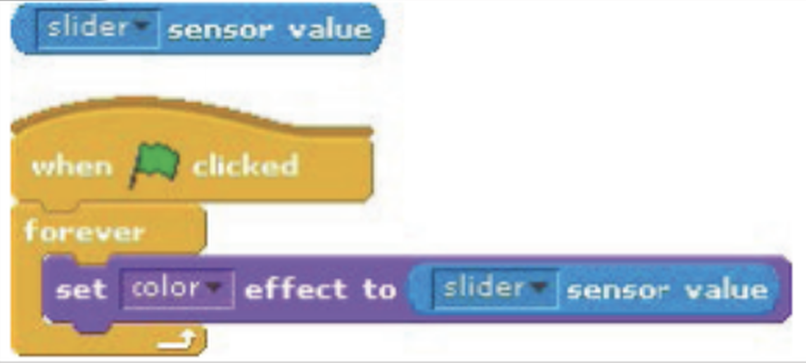
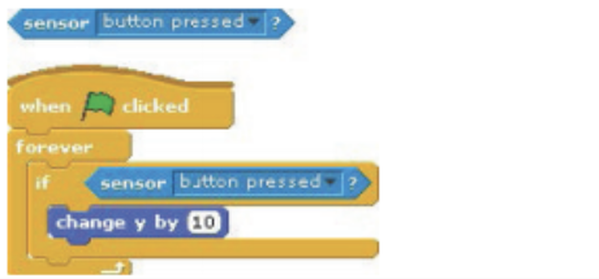
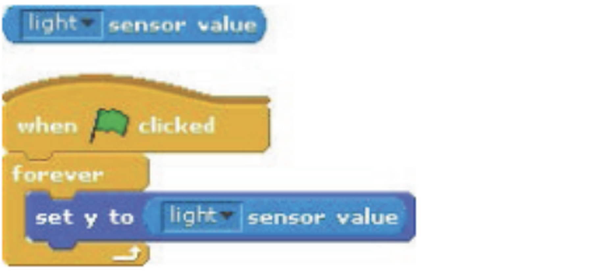
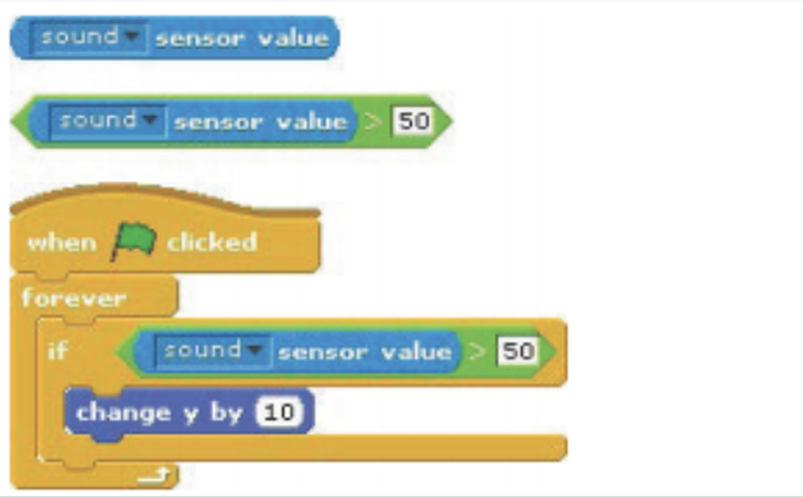
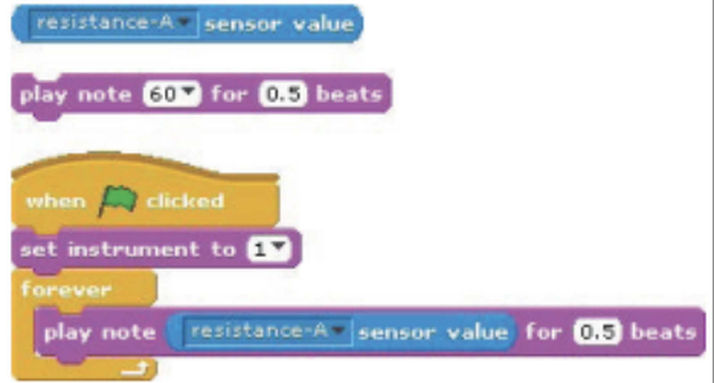
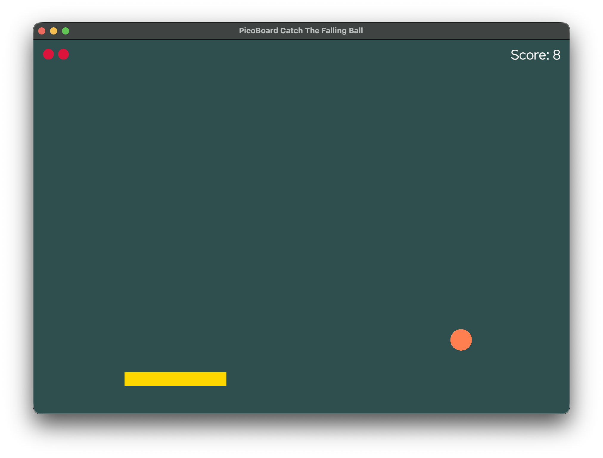

# From Scratch To Kotlin

This repository is an educational Kotlin/JVM workspace for learners who have started programming with Scratch and are ready to take the next step toward text-based programming.

If you do not know Scratch yet, start there first: [Scratch](https://scratch.mit.edu/) is a great first tool for getting into programming because it lets learners build interactive stories, animations, and games with visual blocks. The Scratch website also provides many learning resources, tutorials, and example projects that help beginners understand programming concepts before moving on to text-based code.

It keeps some familiar Scratch ideas, such as sprites, a stage, coordinates, collisions, and sensor input, but expresses them in Kotlin code. In that sense, it is intended as a migration path from block-based programming to "real" programming with source files, functions, types, build tasks, and an IDE.

It combines three layers:

- small programming exercises that students can run and edit
- a Scratch-like 2D playground for simple game projects
- a reusable PicoBoard library that hides the serial protocol details

The goal is to let students start with sensor values, then use those values to control an interactive game, without first having to understand serial communication or graphics setup.

## Disclaimer

I developed this project only for a two-week internship completed by a student at the company where I work. I already had a PicoBoard available, which is why I implemented support for it, but it is outdated hardware and not easy to acquire in large quantities. This project can absolutely be used without a PicoBoard or similar hardware: you can also just use the Scratch-stage-like functions to build a simple game. If you find a good alternative, I am absolutely willing to implement support for it if I am provided with a unit or compensated for the cost of purchasing one.

This project is shared as-is, but I am willing to work with educators if there are still obstacles that need to be overcome before it can be used effectively in a classroom or learning setting. If you are interested in using this project or adapting it for teaching, please contact me.

## Physical Input With The PicoBoard



The PicoBoard is a small sensor board that was commonly used with Scratch 1.x to connect physical inputs to programs. It has built-in sensors and connectors for external inputs, so learners can control programs with light, sound, a slider, a button, and simple circuits.

This project brings that same learning tool into a Kotlin environment. Students can keep experimenting with physical interaction, but now they write text-based Kotlin code instead of Scratch blocks.

For the original Scratch 1.x PicoBoard context, see SparkFun's guide:

[Using the SparkFun PicoBoard and Scratch](https://learn.sparkfun.com/tutorials/using-the-sparkfun-picoboard-and-scratch/all)

## PicoBoard Sensor Reference

| Sensor | What It Does | Scratch Blocks | Read From `PicoBoardService` In A Scratch Stage |
|--------|--------------|----------------|-------------------------------------------------|
| **Slider** | A slide potentiometer, also called a variable resistor. It changes continuously on a scale from `0` to `100`. |  | `service?.slider()` |
| **Button** | A boolean input with only two states: pressed or not pressed. Use it to trigger actions such as starting a game, jumping, or changing color. |  | `service?.buttonPressed() == true` |
| **Light** | A light sensor that reports values from `0` to `100`, depending on how much light reaches the board. |  | `service?.light()` |
| **Sound** | A sound sensor that reports values from `0` to `100` by detecting vibrations in the air. |  | `service?.sound()` |
| **A, B, C, D** | Four external resistance inputs for experiments with alligator clips and external sensors. |  | `service?.resistanceA()`<br>`service?.resistanceB()`<br>`service?.resistanceC()`<br>`service?.resistanceD()` |

## Before You Start

This repository is meant for practicing with PicoBoard inputs and small interactive programs. It does not try to teach the absolute Kotlin basics such as simple statements, variables, running code in an IDE, or general IDE setup.

If you are new to Kotlin, learn those basics first with an introductory Kotlin resource and then come back to these exercises.

For German-speaking learners, this video is a good starting point. It teaches the Kotlin basics needed to build a command-line rock paper scissors program, which is enough preparation for the exercises in this repository:

[Kotlin Tutorial on YouTube](https://www.youtube.com/watch?v=05Wzq-pNPmk)

## Learning Path

1. Read simple PicoBoard sensor values.
2. Explore built-in and external PicoBoard inputs.
3. Use keyboard fallback controls when no board is connected.
4. Play a simple song with generated tones.
5. Build a small Scratch-style game with sprites, movement, collisions, and score keeping.
6. Compare the starter exercises with complete solutions.
7. Get creative and start building your own game

## Projects

The Gradle build is split into four projects:

- `:programming-exercise-tasks` contains student starter exercises
- `:solutions` contains completed versions of the exercises
- `:scratch-playground` contains the Scratch-like 2D API used by the game exercises
- `:picoboard` contains the PicoBoard library and CLI tooling

## Requirements

- Java 21
- Git for checking out the project
- Gradle, usually through the included `./gradlew` wrapper
- A classic PicoBoard or compatible Scratch sensor board for hardware exercises
- macOS, Linux, or Windows

Gradle uses Java 21 toolchains. If Java 21 is not available locally, Gradle can provision it automatically.

## Build

```bash
./gradlew build
```

## Exercise 1: Read Sensor Values

Starter file:

[ReadSensorValues.kt](programming-exercise-tasks/src/main/kotlin/de/moritzf/picoboard/examples/firstproject/ReadSensorValues.kt)

Run it with:

```bash
./gradlew readSensorValues
```

This exercise introduces the easy PicoBoard API and asks students to inspect the built-in and external sensor values.

## Exercise 2: Catch The Falling Ball



Starter file:

[CatchTheFallingBall.kt](programming-exercise-tasks/src/main/kotlin/de/moritzf/picoboard/scratch/examples/catchthefallingball/CatchTheFallingBall.kt)

Run it with:

```bash
./gradlew runCatchTheFallingBall
```

The task is to implement the game logic:

- move the catcher left and right
- make the ball fall down
- reset the ball when it touches the catcher
- count how many balls were caught

The exercise uses PicoBoard controls when a board is available and keyboard controls otherwise.

## Exercise 3: Alle meine Entchen

Starter file:

[AlleMeineEntchen.kt](programming-exercise-tasks/src/main/kotlin/de/moritzf/picoboard/scratch/examples/allemeineentchen/AlleMeineEntchen.kt)

Run it with:

```bash
./gradlew runAlleMeineEntchen
```

The task is to complete the melody of the German children's song "Alle meine Entchen", usually translated as "All My Ducklings", with generated tones. It introduces `playToneUntilDone(...)` without requiring any sound files.

## Solutions

Full solution:

[CatchTheFallingBallSolution.kt](solutions/src/main/kotlin/de/moritzf/picoboard/scratch/examples/catchthefallingball/solution/CatchTheFallingBallSolution.kt)

Run it with:

```bash
./gradlew runCatchTheFallingBallSolution
```

The solution first tries PicoBoard auto-selection. If no suitable board is available, it falls back to keyboard controls.

Alle meine Entchen solution:

[AlleMeineEntchenSolution.kt](solutions/src/main/kotlin/de/moritzf/picoboard/scratch/examples/allemeineentchen/solution/AlleMeineEntchenSolution.kt)

Run it with:

```bash
./gradlew runAlleMeineEntchenSolution
```

## Scratch Playground

The `:scratch-playground` project provides a small Scratch-shaped API on top of [KorGE](https://korge.org/):

- fixed logical stage size with a resizable window
- centered Scratch-like coordinates
- simple `rectangle(...)`, `circle(...)`, `text(...)`, image sprites, and sounds
- sprite properties such as `x`, `y`, `direction`, `size`, `scale`, `rotationStyle`, and `visible`
- helpers such as `move(...)`, `turnLeft(...)`, `turnRight(...)`, `touching(...)`, `touchingEdge()`, and `ifOnEdgeBounce()`

Common Scratch blocks translate to the Kotlin playground like this:

| Current Scratch block or concept | Kotlin playground equivalent | Notes |
|----------------------------------|------------------------------|-------|
| Stage | `scratchStage(width, height, title) { ... }` | Creates the window and centered Scratch-like coordinate system. |
| Sprite | `rectangle(...)`, `circle(...)`, `image(...)`, or `text(...)` | Shapes and images are the normal visible game objects. |
| `when green flag clicked` | `suspend fun main() = scratchStage { ... }` | Program startup replaces the green flag event. |
| `forever` | `forever { ... }` | Runs once per frame. |
| `if <condition> then` | `if (condition) { ... }` | Normal Kotlin control flow. |
| `repeat until <condition>` | `while (!condition) { ... }` | Normal Kotlin control flow. |
| `move (10) steps` | `sprite.move(10)` | Moves in the current `direction`. |
| `turn right (15) degrees` | `sprite.turnRight(15)` | Clockwise rotation. |
| `turn left (15) degrees` | `sprite.turnLeft(15)` | Counter-clockwise rotation. |
| `point in direction (90)` | `sprite.pointInDirection(90)` | Same Scratch direction system: `90` points right. |
| `point towards [sprite]` | `sprite.pointTowards(otherSprite)` | Points at another playground sprite. |
| `go to x: (0) y: (0)` | `sprite.goTo(0, 0)` | `(0, 0)` is the stage center. |
| `change x by (10)` | `sprite.changeXBy(10)` | Positive values move right. |
| `set x to (10)` | `sprite.x = 10` | Direct property assignment. |
| `change y by (10)` | `sprite.changeYBy(10)` | Positive values move up. |
| `set y to (10)` | `sprite.y = 10` | Direct property assignment. |
| `if on edge, bounce` | `sprite.ifOnEdgeBounce()` | Also clamps the sprite back inside the stage. |
| `show` / `hide` | `sprite.show()` / `sprite.hide()` | Also available as `sprite.visible = true` or `false`. |
| `set size to (100)%` | `sprite.size = 100.0` | `100.0` is the original size. |
| `change size by (10)` | `sprite.size += 10.0` | Uses Kotlin property updates. |
| `set rotation style [all around]` | `sprite.rotationStyle = ScratchRotationStyle.ALL_AROUND` | Also supports `LEFT_RIGHT` and `DONT_ROTATE`. |
| `touching [sprite]?` | `sprite.touching(otherSprite)` | Uses shape or image collision detection. |
| `touching edge?` | `sprite.touchingEdge()` | Checks the stage boundary. |
| `key [space] pressed?` | `keyPressed(Key.SPACE)` | Uses KorGE keyboard constants such as `Key.LEFT` and `Key.RIGHT`. |
| Scratch variables | Kotlin variables such as `var score = 0` | Use normal Kotlin values and update displayed text manually. |
| Scratch variable display | `val label = text(...); label.text = "Score: $score"` | Text labels replace Scratch's automatic variable monitor. |
| Costume-like image sprite | `val player = image("player.png")` | Put PNG files in `src/main/resources/`; use transparency for custom object shapes instead of rectangular images. |
| `start sound [pop]` | `pop.play()` | Load first with `val pop = sound("pop.wav")`; sound files belong in `src/main/resources/`. |
| `play sound [pop] until done` | `pop.playUntilDone()` | Suspends until playback finishes. |
| `play note (60) for (0.5) beats` | `playToneUntilDone("C", 0.5)` | Generates a tone without a sound file; supports notes such as `C`, `C#`, `Cb`, `F`, `G`, `A`, `H`, and `C5`. |
| `stop all sounds` | `stopAllSounds()` | Stops sounds started through the playground sound helpers. |
| Clones | Use Kotlin functions, constructors, lists, or loops | Intentionally not mirrored as a Scratch feature. Kotlin has better tools for creating similar or identical things multiple times. |
| Broadcasts and messages | Use functions, objects, and normal OOP structure | Intentionally not mirrored as a Scratch feature. Kotlin can express communication directly with first-class functions and objects. |

Clones and broadcasts are intentionally not implemented as direct Scratch-style helpers. In the author's view, those Scratch features are mostly workarounds for the fact that Scratch does not expose the tools of a full programming language. Once learners move to Kotlin, functions, constructors, objects, lists, and the usual object-oriented programming strategies are clearer and more powerful ways to solve the same problems.

The playground guide explains the main control structures used by the examples, including `runBlocking`, `scratchStage { ... }`, setup code, `forever { ... }`, and normal Kotlin `if`, `when`, and `while` blocks.

See the playground guide:

[scratch-playground/README.md](scratch-playground/README.md)

## Technical Details

Everything up to this point is the most relevant part for learners and educators. The rest of this README gets more technical and describes how the PicoBoard support is implemented. The exercises and playground are designed to just work without requiring hardware setup knowledge, serial communication details, or an understanding of the PicoBoard protocol.

### PicoBoard Library

The `:picoboard` project contains the reusable Kotlin/JVM library. It:

- works through `jSerialComm`
- exposes raw 10-bit sensor values and Scratch-style scaled values
- supports one-shot reads and scheduled polling
- includes an easy API for classroom exercises
- includes lower-level APIs for direct control

The implementation targets the classic Scratch 1.x PicoBoard protocol:

- `38400` baud, `8N1`
- host sends poll byte `0x01`
- board replies with an 18-byte packet made of nine high/low channel pairs

The parser and scaling logic follow the MIT Scratch Board technical guide, and the serial setup matches the SparkFun PicoBoard getting-started documentation.

### CLI Tools

The PicoBoard CLI is useful for checking ports and debugging outside the exercises.

List available serial ports:

```bash
./gradlew :picoboard:run --args="--list-ports"
```

Read continuously with library auto-selection:

```bash
./gradlew :picoboard:run --args="--interval-ms 100"
```

Read continuously from a specific PicoBoard:

```bash
./gradlew :picoboard:run --args="--port /dev/cu.usbserial-A5061E1Q --interval-ms 100"
```

Read 10 frames and exit:

```bash
./gradlew :picoboard:run --args="--port /dev/cu.usbserial-A5061E1Q --count 10"
```

### Auto-Selection

The library can auto-select a suitable serial device:

- `PicoBoard.findAutoSelectedPort()` returns the uniquely best match or `null`
- `PicoBoard.requireAutoSelectedPort()` throws if no suitable device is found or if selection is ambiguous
- `PicoBoard.open()` auto-selects a suitable device and opens it

If you want full control, keep using `PicoBoard.open(portPath)` or `PicoBoard.open(port)`.

### Hardware Notes

- On older systems, you may need FTDI VCP drivers installed before the PicoBoard appears as a serial device.
- On macOS, the relevant port is typically `/dev/tty.usbserial-*` or `/dev/cu.usbserial-*`.
- On Linux, it is commonly `/dev/ttyUSB*`.
- On Linux, prefer the stable symlink under `/dev/serial/by-id/` when possible, for example `/dev/serial/by-id/usb-FTDI_FT232R_USB_UART_A5061E1Q-if00-port0`.
- On Windows, it appears as `COMx`.

### IntelliJ On Linux

On this project, a normal IntelliJ installation on Linux works with the PicoBoard.
Testing with IntelliJ's bundled JetBrains Runtime successfully opened `/dev/ttyUSB0` and read a valid PicoBoard packet.

If PicoBoard access fails from your IDE, the usual causes are outside the library:

- the IDE was installed from a sandboxed package format that restricts device access
- the run configuration is using a different runtime or environment than your shell
- the wrong serial device was selected

For Linux development, prefer a normal JetBrains Toolbox or tarball installation over sandboxed package formats when you need direct access to `/dev/ttyUSB*`.
